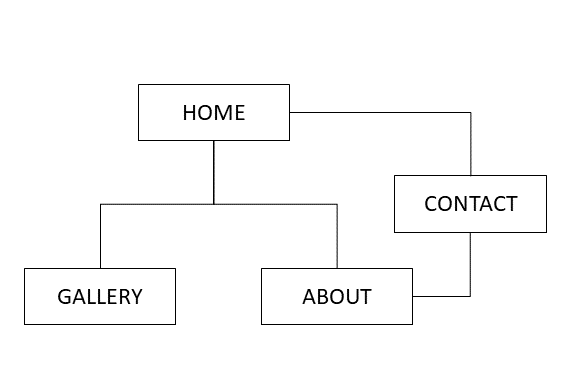
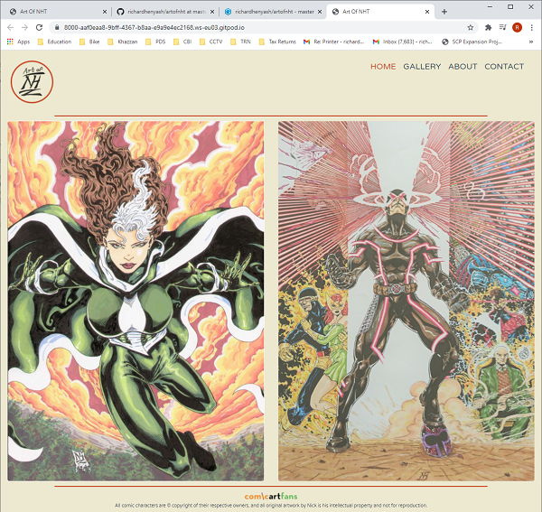
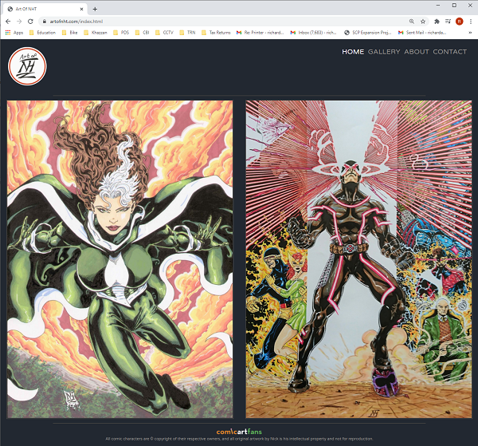
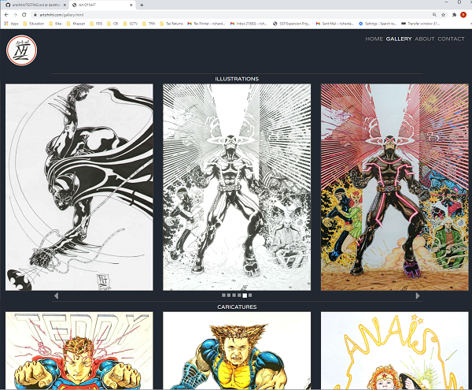

# Art Of NHT #

## Contents ##
- [Background](#background)
- [Business Goals](#business-goals)
- [Project Goals](#project-goals)
- [User Goals](#user-goals)
- [UX](#ux)
    - [Project Strategy](#project-strategy)
        - [Opportunities Matrix](#opportunities-matrix)
        - [Initial Development Phase](#initial-development-phase)
    - [Project Scope](#project-scope)
        - [User Demographics](#user-demographics)
        - [User Requirements](#user-requirements)
        - [User Stories](#user-stories)
        - [Contraints](#constraints)
        - [Functional Requirements](#functional-requirements)
        - [Business Rules](#business-rules)
        - [Features](#features)
    - [Site Map](#site-map)
    - [Wireframes](#wireframes)
    - [Design Choices](#design-choices)
        - [Fonts](#fonts)
        - [Colours](#colours)
- [Technologies](#technologies)
    - [Languages](#languages)
    - [Frameworks Libraries and Tools](#frameworks-libraries-and-tools)
- [Features](#features)
    - [Features Implemented in Phase 1](#features-implemented-in-phase-1)
    - [Features To Be Implemented In Future Development Phases](#features-to-be-implemented-in-future-development-phases)
    - [Design Changes During The Phase 1 Development](#design-changes-during-the-phase-1-development)
- [Testing](#testing)
- [Deployment](#deployment)
- [Credits](#credits)
- [Acknowledgements](#acknowledgements)

## Background ##
Nick Hope Thompson is a talented comic artist who has been drawing for fun and professionally for many years. He does not currently have an online presence. He has sold pieces of his comic art, has previously been commisioned to produce pieces and would like to increase his opportunities to work professionally producing comic art.

## Business Goals ##
To increase sales of Nick's art.

## Project Goals ##
To showcase the artist's portfolio, increase the artist's profile within the comic art community and to provide a means for prospective clients to engage.

## User Goals ##
To browse comic art for fun and inspiration and potentially to buy. To commission an artist to create some personalised art work.

## UX ##

### Project Strategy ###
To define the overall project strategy, an initial project strategy meeting was held with the client.

#### Opportunities Matrix ####
The following opportunities were identified and ranked using a score of 1 - 5 for importance and viability:

Opportunity | Importance |Viability
------------| -----------|---------
Create online presence|5|5
Showcase portfolio|5|4
Provide contact information|5|5
Biography|4|5
Link to artist page on [comicartfans.com](https://www.comicartfans.com/)|3|3
Subscribe|2|1
Communicate pricing information|2|5
Increase social media followers|2|3
Create a blog|5|5
Develop online sales capability|1|1

#### Initial Development Phase ####
The opportunities matrix was used to help decide which items should be included for the initial development phase (phase 1):
Item|Development Phase
----|-----------------
Create an online presence|1
Showcase portfolio of work to potential customers|1
Provide contact information to potential customers|1
Biography|1
Provide link to artist page on comicartfans.com|1
Subscribe|2
Increase social media followers|2
Create a blog|2
Develop online sales capability|3

### Project Scope ###
#### User Demographics ####
* The primary users of the site will be comic art fans. The demographics of comic art fans are quite wide - male and female from ages 5 and up who have an appreciation for comic art.
* A simple, colorful and attractive design would fit this demographic. As the demographic is particularly interested in art and design, the site needs to reflect this and a vibrant and modern design is of high importance.

#### User Requirements ####
* Visually engaging
* Easy to navigate
* The key information should be layed out in a simple, easy to follow and clear way.
* Responsive design is required as users may be viewing the site on Mobile, Tablet or Desktop.

#### User Stories ####
* ***As a user, I want to browse comic art sites for fun and inspiration.***
* ***As a user, I am searching for existing comic art to buy.***
* ***As a user, I am searching for an artist to commission some work.***
* ***As a user, I want to contact the artist.***
* ***As a user, I want to find out more about a specific piece of art.***

#### Constraints #####
* Developer skill set - the developer is currently unable to develop an online sales capability, but this may be considered for future development phases.
* The client is reluctant to create a social media presence on facebook, instagram etc, but does have an artist page on [comicartfans](https://www.comicartfans.com) which should be linked to.
* The client has time constaints on the amount of work he can produce as he has a full time job. We discussed incorporating a Subscribe or Sign Up option, which would allow the artist to produce art and then contact a mailing list of prospective buyers. We decided not to include this feature in phase 1 due to the complications of storing email marketing lists within the constraints of the GDPR regulations.
* The website functional features and background should not be to 'loud' or detract from the main focus of the website, which is presenting the artist's colourful and attractive work.

#### Functional Requirements ####
* The user would like to view a portfolio of the artist's work.
* The user requires contact information to enable them to contact the artist.
* The user potentially requires pricing information. It was decided during the initial stategy meeting with the client that pricing information would not be disclosed on the website, but would be provided on request.

#### Business rules ####
* Copyright notices - all comic book characters are copyright of their respective owners. The copyright notice should appear on each page in the footer.

#### Features ####
The following key features have been identified and scored from 1 - 5 for importance and difficulty. The proposed development phase has also been indicated:
Feature|Importance|Difficulty|Development Phase
-------|----------|----------|-----------------
Navigation menu | 5 | 2 | 1
Portfolio images | 5 | 3 | 1
Contact form | 5 | 1 | 1
Biography | 4 | 2 | 1
Copyright notices | 5 | 1 | 1
Link to comicartfans.com | 3 | 1 | 1
Links to social media | 2 | 1 | 2
Subscribe feature| 3 | 2 | 2
Blog | 1 | 4 | 2
Online Sales Capability | 1 | 5 | 3

### Site Map ###
A [Site Map](./assets/wireframes/sitemap.png) was produced for discussion prior to the initial project strategy meeting with the client, and is shown below:  

### Wireframes ###
An [Initial Sketch](./assets/wireframes/rev0) was produced for discussion prior to the initial project strategy meeting with the client.

[Initial Wireframes](./assets/wireframes/rev1) showing different options for the Home and Gallery pages were produced using [balsamiq](https://balsamiq.com/index.html) and presented to the client. 
The base case was selected for the Home and Gallery pages.

[Responsive Design Wireframes](./assets/wireframes/rev2) were then developed based on the initial wireframes showing the Home, Gallery and About pages as viewed on desktop, tablet and mobile devices.

The home page features two large bright and colorful illustrations, a navigation menu, the NHT logo provided by the client and 
a link to the artist's page on [comicartfans](https://www.comicartfans.com/gallerydetail.asp?gcat=682). We decided to use two illustrations for the home page 
as the artist's most colourful illustrations are in portrait orientation and this would allow 2 images to be tiled side by side on a desktop view, 
with one of the images being removed or the images being tiled vertically on smaller devices. 

The Gallery is presented as a seperate page. The gallery features the artist's favourite work divided into the categories "Illustrations" 
and "Caricatures". The images are tiled in 2 rows corresponding to the "Illustrations" and "Caricatures" categories, 
with 3 columns shown on a desktop view, 2 columns shown on a tablet view and 1 column shown on a mobile view.

The Biography and Contact information is presented on the About NHT page. The about page includes a contact button which will open up a contact form.

### Design Choices ###

#### Fonts ####
**Varela Round** has been chosen as the font for all text content. The font is clean and modern and has a soft rounded feel which ties in well with comic art.
* font-family: 'Varela Round', sans-serif;  

#### Colours ####
The colour pallete was initally chosen based on the red of the Art Of NHT logo supplied by the client (#C93C1C). 
The [mycolor](https://mycolor.space) pallete generator tool was used to generate a complementary colour pallete 
based on the logo red (#C93C1C).
The initial colour pallete is shown below:  

A screen print of the [Home](index.html) page with the initial colour scheme is shown below:  

After the home and gallery pages were constructed for review by the client using the colour pallete initially chosen, 
an optional "dark mode" theme was created by the developer, using grey and dark colours for the background and 
functional elements of the website.
The client and developer both preferred the "dark mode" theme, as we felt that this showcased the artist's 
content better and really made the artwork stand out, so this option was selected and developed further into the final website.
The final colour pallete is shown below:  

  

* White, used for highlighting
* #FAFAFA - slightly off white, used for headings, highlighting, text and carousel indicators
* #9A9793 - light grey, used for navigation links and about page image outline
* #404040 - dark grey, used for block dividers, home page and gallery image outlines
* #222831 - very dark grey, used for background containers
* #D65A31 - red, used for links on about page

## Technologies ##
### Languages ###
* [HTML](https://www.w3schools.com/html/default.asp)
* [CSS](https://www.w3schools.com/css/default.asp)
* [JavaScript](https://www.w3schools.com/js/default.asp) (used internally by [Bootstrap](https://getbootstrap.com/docs/4.5/getting-started/introduction/))

### Frameworks Libraries and Tools ###
* [Bootstrap](https://getbootstrap.com/docs/4.5/getting-started/introduction/)
* [jQuery](https://jquery.com/) (used internally by [Bootstrap](https://getbootstrap.com/docs/4.5/getting-started/introduction/))
* [Font Awewsome](https://fontawesome.com/)
* [Google Fonts](https://fonts.google.com/)
* [Form Spree](https://help.formspree.io/hc/en-us)

## Features ##
### Features Implemented in Phase 1 ###
* Logo (including hover styling, links to home page if selected):  
  

* Navigation Menu (including hover styling):  
  

* Footer with link to artist page on [comicartfans](https://www.comicartfans.com/gallerydetail.asp?gcat=682), (including hover styling):  
  

* [Responsive Design](./assets/testing/responsive-design).  

* Large, responsive [Home](index.html) page image(s) which pop out into [Modals](./assets/testing/image-modals) which include image title and medium if selected. 
2 images are shown on the [Home](index.html) page on larger devices, and 1 image is shown on the [Home](/index.html) page on smaller devices:  
  
    

* Responsive [Gallery](gallery.html) page including bootstrap image carousels to display art categorised into Illustrations and Caricatures. 
The carousels feature 1 image panel on small displays, 2 image panels on medium displays and 3 image panels on large displays. 
The carousel controls are subtly designed and are located under the images so as not to detract from the art, which is the focus of the 
website. The carousels have been set as static (the user has to select left or right to move the images on) as we feel this will improve 
the user experience. The carousel images pop out into [Modals](./assets/testing/image-modals) which include image title and medium if selected:  
  
  

* [About](about.html) page including artist biography, profile picture, contact links and large, bright call to action "Contact Nick" button. Profile picture, "Contact Form" link and "Contact Nick" button link to the [Contact Form](contact.html) form. The email link creates an email to Nick in the user's default email application:  
  

* [Contact Form](contact.html) containing fields for Name, Email address and Message, and a large Send button. 
If all fields are entered correctly, an email is sent to nickhopet@hotmail.com. This feature is deployed using [Formspree](https://help.formspree.io/hc/en-us):  
  

### Features To Be Implemented In Future Development Phases ###
* The [Formspree](https://help.formspree.io/hc/en-us) form submission message can be customised to improve the user experience, however this requires a payed account with [Formspree](https://help.formspree.io/hc/en-us).
This may be considered for implementation in the future, as the free service provided by [Formspree](https://help.formspree.io/hc/en-us) is limited to 50 contact messages per month.
Another future development option would be to submit the contact form via [php](https://www.php.net/). It is not possible to deploy [php](https://www.php.net/) on a site hosted by [GitHub](https://github.com/) pages, 
so the site would need to be moved to another provider that supports [php](https://www.php.net/) in order to implement this.
* Subscribe feature on contact form - this may be implemented in the future if the artist decides to
launch a web marketing campaign.
* Links to social media (dependant on artist being willing to join social media networks).
* Blog - (dependant on artist's time constraints).
* Online Sales Capability - (dependant on developer's technical capability).

### Design Changes During The Phase 1 Development ###
* Colour scheme - the colour scheme was changed mid-way through the development as described in the [Colours](#colours) section. 
The original colour theme is on the [master](https://github.com/richardhenyash/artofnht/tree/master) branch in the [GitHub](https://github.com/) 
repository. A new [darktheme](https://github.com/richardhenyash/artofnht/tree/darktheme) branch was created for the dark theme option and 
developed into the final website. This is set as the source for [GitHub](https://github.com/) pages.
* Gallery carousel controls - these were initially located at the bottom of the images within the image panels, but were moved underneath the carousel elements as we felt this provided a better user experience. 
See [Gallery Testing Screen Prints](./assets/testing/gallery-page) and example below:  
  

* Gallery carousel images - the images were initially being sized by using specific media queries for a range of device widths to set the 
height of the image. The gallery images were then resized to 1200px x 1680px, to enable bootstrap to auto size the gallery in 1 panel, 
2 panels or 3 panels depending on screen size. This enables the gallery to scale fluidly and without degrading image quality for any 
screen size up to 3600px wide. [Gallery Testing Screen Prints](./assets/testing/gallery-page), and example below:  
  

* Contact form - the contact form was initially developed as a modal pop-up form, but this was found not to work with the [Formspree](https://help.formspree.io/hc/en-us) service. The contact form was redesigned as a [web page](contact.html).

## Testing ##

Further testing information and screen prints can be found in [Testing.md](TESTING.md).

## Deployment ##
The project has been developed using [GitPod](https://www.gitpod.io/) and [GitHub](https://github.com/). 
The project was regularly commited to [GitHub](https://github.com/) during the initial development phase.
The website resides as a repository in [GitHub](https://github.com/) and has been been deployed on [GitHub](https://github.com/) 
pages using the custom domain [Art Of NHT](www.artofnht.com) purchased from [GoDaddy](https://uk.godaddy.com/). 
The code may be downloaded to a local computer from the [GitHub](https://github.com/) repository by going to 
the [Code Repository Location](https://github.com/richardhenyash/artofnht) on [GitHub](https://github.com/), 
selecting the "Code" option and downloading as a zip file.  
Note that the deployed [GitHub](https://github.com/) pages source branch is the [darktheme](https://github.com/richardhenyash/artofnht/tree/darktheme) branch - 
see [Design Changes During The Phase 1 Development](#design-changes-during-the-phase-1-development) for more details.  

The steps required to deploy the website to a custom domain using GitHub pages are as follows:
* Open the DNS management page in the GoDaddy Domain Manager for the relevant domain which you have purchased through GoDaddy.
* Edit the Type "A" record. The IP address in the "Value" field should be changed to 185.199.108.153.
* Edit the Type "CNAME" record with the field "Name" set to "www". This should be changed to the relevant [GitHub](https://github.com/) pages web adrress (username.github.io). For my GitHub pages this is (richardhenyash.github.io).
* Add 3 further Type "A" records with "Name" set to "@", and "Value" fields set to IP addresses 185.199.109.153, 185.199.110.153, 185.199.111.153.
* Go to the [Settings](https://github.com/richardhenyash/artofnht/settings) in the [GitHub](https://github.com/) repository.
* Scroll [GitHub](https://github.com/) Pages section.
* In the Source section select the [darktheme](https://github.com/richardhenyash/artofnht/tree/darktheme) branch from the dropdown menu.
* In the Custom domain box, add the custom domain name (artofnht.com).
* Tick "Enforce HTTPS".
* This creates a a new file in the root directory called CNAME, which should have one line of text which is the custom domain name (artofnht.com).

## Credits ##

I gained additional help and inspiration on dark mode theme colours from the following link:
* [codeburst](https://codeburst.io/50-shades-of-dark-mode-gray-d3e9907b1194)

I gained additional insight and help on bootstrap carousel functionality from the following links:
* [w3schools](https://www.w3schools.com/bootstrap/bootstrap_carousel.asp)
* [medium link 1](https://medium.com/wdstack/bootstrap-4-custom-carousel-94a537364fde)
* [Stack Overflow link 1](https://stackoverflow.com/questions/46249541/change-arrow-colors-in-bootstraps-carousel)
* [Stack Overflow link 2](https://stackoverflow.com/questions/47400874/bootstrap-4-change-position-of-carousel-controls/50352437)
* [Stack Overflow link 3](https://stackoverflow.com/questions/39536075/how-to-change-the-carousel-active-indicator-color-bootstrap/39536141)

Additional help on styling horizontal rulers was found at the following link:
* [w3schools](https://www.w3schools.com/howto/howto_css_style_hr.asp)

Additional help on aria label attributes was found at the following link:
* [MDN Web Docs](https://developer.mozilla.org/en-US/docs/Web/Accessibility/ARIA/ARIA_Techniques/Using_the_aria-label_attribute)

Additional help on fade-in animations was found at the following link:
* [Stack Overflow link 4](https://stackoverflow.com/questions/11679567/using-css-for-a-fade-in-effect-on-page-load)

Additional help on deploying the website to a godaddy domain using github pages was found at the following links:
* [Github documentation](https://docs.github.com/en/free-pro-team@latest/github/working-with-github-pages/managing-a-custom-domain-for-your-github-pages-site)
* [Medium link 2](https://medium.com/@JinnaBalu/godaddy-domain-with-github-pages-62aed906d4ef)

## Acknowledgements ##
Thanks to the following for your help and inspiration during this project:
* [Nick Hope-Thomson](https://artofnht.com/) for his amazing art work, I hope this website helps you acheive your dreams!
* [Sarah Ash](https://artofnht.com/) for helping Nick to quickly put a clear and concise brief together.
* [Neringa Bickmore](https://github.com/neringabickmore) for getting me started off on the right footing and for your very helpful review and comments on the website and documentation.
* My remote mentor [Allen Thomas Varghese](https://github.com/allentv) for the help getting me started and for the insightful review and comments on the website.
