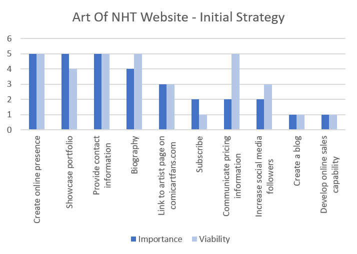

# Art Of NHT

## Background
Nick Hope Thompson is a talented amateur comic artist who has been drawing for fun for many years. He does not currently have an online presence. He has sold his art and has previously been commisioned to produce art and would like to increase his opportunities to work professionaly producing comic art. 

## Business Goals
To increase sales of Nick's art.

## Project Goals
To showcase the artist's portfolio, increase the artist's profile within the comic art community and to provide a means for prospective clients to engage.

## UX

### Project Strategy
To define the overall project strategy, an initial project strategy meeting was held with the client.

#### Opportunities Matrix
The following opportunities were identified and ranked using a score of 1 - 5 for importance and viability:

Opportunity | Importance |Viability
------------| -----------|---------
Create online presence|5|5
Showcase portfolio|5|4
Provide contact information|5|5
Biography|4|5
Link to artist page on comicartfans.com|3|3
Subscribe|2|1
Communicate pricing information|2|5
Increase social media followers|2|3
Create a blog|5|5
Develop online sales capability|1|1

#### Initial Development Phase
The opportunities matrix was used to help decide which items should be included for the initial development phase (phase 1):
Item | Development Phase
-----|------
Create an online presence|1
Showcase portfolio of work to potential customers|1
Provide contact information to potential customers|1
Biography|1
Provide link to artist page on comicartfans.com|1
Subscribe|1
Increase social media followers|2
Create a blog|2
Develop online sales capability|3

### Project Scope
#### User Objectives
* The user is searching for an artist to commission work.
* The user is searching for comic art to buy.
* The user is browsing comic art sites for inspiration.

#### User Demographics
* The primary users of the site will be comic art fans. The demographics of comic art fans are quite wide - male and female from ages 5 up to 60 who have an appreciation for comic art.
* A simple, colorful and attractive design would fit this demographic. As the demographic is particularly interested in art and design, the site needs to reflect this and an attractive, vibrant and modern design is of high importance.

#### Functional Requirements
* The user needs to be able to see a portfolio of the artist's work.
* The user requires contact information to enable them to contact the artist.
* The user potentially requires pricing information. It was decided during the initial stategy meeting with the client that pricing information would not be disclosed on the website, but would be provided on request.

#### Constraints
* Developer skill set - the developer is currently unable to develop an online sales capability, but this may be considered for future development phases.
* The client is reluctant to create a social media presence on facebook, instagram etc, but does have an artist page on https://www.comicartfans.com/ which should be linked to.
* The client has time constaints on the amount of work he can produce as he has a full time job. For this reason, we discussed and decided to incorporate a Subscribe button to the about page, which would allow the artist to produce art and then contact a mailing list of prospective buyers. 

#### Business rules
* Copyright notices - all comic book characters are copyright of their respective owners. Copyright notice should appear on each page in the footer.

#### Features
The following key features have been identified and scored from 1 - 5 for importance and difficulty. The proposed development phase has also been indicated:
Feature | Importance | Difficulty | Development Phase
--------|------------|------------|------------------
Navigation menu | 5 | 2 | 1
Portfolio images | 5 | 3 | 1
Contact information and links | 5 | 1 | 1
Biography | 4 | 2 | 1
Copyright notices | 5 | 1 | 1
Link to comicartfans.com | 3 | 1 | 1
Links to social media | 2 | 1 | 2
Blog | 1 | 4 | 2
Online Sales Engine | 1 | 5 | 3

### Wireframes
A hand sketch was produced prior to the initial project strategy meeting with the client:
[Hand Sketch](.//assets/wireframes/initialhandsketch.jpg)

Further wireframes showing different options for the Home and Gallery pages were produced using [balsamiq](https://balsamiq.com/index.html) and presented to the client.

For the initial design, The home page will feature 2 large bright and colorful illustrations, a navigation menu, the NHT logo provided by the client and a link to https://www.comicartfans.com/. We decided to use two illustations as the artist's best and most colourful illustrations are portrait orientation and this would allow 2 images to be tiled side by side on a desktop view, with one of the images being removed or the images being tiled vertically on smaller devices. 

The Gallery will be initially presented as a section of the home page, to allow for simple linear navigation through the most important content on the site. The gallery will feature the artist's favourite pictures divided into the categories "Illustrations" and "Caricatures". The images will be tiled in 2 rows corresponding to the "Illustrations" and "Caricatures" categories, with 3 columns on a desktop view, 2 columns on a tablet view and 1 column on a mobile view.

The Biography and Contact information will be presented on the About NHT page. A Subscribe button will also be provided. 