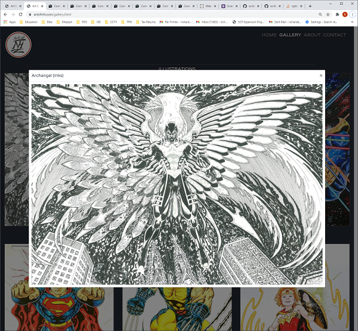

# Art Of NHT - Testing #

## Contents ##
- [Automated Testing](#automated-testing)
    - [Custom CSS Styling](#custom-css-styling)
    - [HTML](#html)
- [User Stories Testing](#user-stories-testing)
- [Additional UX Testing](#additional-ux-testing)
- [Manual Testing](#manual-testing)
    - [Navigation Links](#navigation-links)
    - [Logo Link](#logo-link)
    - [Footer Link](#footer-link)
    - [Home Page Image Modals](#home-page-image-modals)
    - [Gallery Page Image Modals](#gallery-page-image-modals)
    - [Gallery Page Carousel Controls](#gallery-page-carousel-controls)
    - [Resonsive Design](#responsive-design)
    - [About Page Links](#about-page-links)
    - [Contact Form](#contact-form)
- [Bugs Fixed During Testing](#bugs-fixed-during-testing)
- [Bugs Remaining](#bugs-remaining)

## Automated Testing ##

### Custom CSS Styling ###
[Custom CSS styling](./assets/css/style.css) was validated using the [W3C CSS validation service](https://jigsaw.w3.org/css-validator/).
2 errors were reported on a redundant class. The class was removed and the code was re-validated, and passed with no errors.

### HTML ###
All HTML code was validated using the [W3C Markup validation service](https://validator.w3.org/). One warning was generated on the [Home](./index.html) page.
This is due to the fact that there is no heading in the main section, which is intentional as this would detract from the overall look and user experience.
A number of errors were detected and fixed in the [Gallery](./gallery.html) page, including 2 closing 'h3' tags which were incorrectly set to 'p', and duplicate id's on the carousel control elements.
The [Gallery](./gallery.html) page now passes validation without errors or warnings. The [About](./about.html) and [Contact](./contact.html) pages both passed validation without errors or warnings.

## User Stories Testing ##
* ***As a user I want to browse comic art sites for fun and inspiration.*** The user can browse through the artist's portfolio of work using the [Gallery](./gallery.html) page.  
The carousel controls allow the user to cycle the images at a time of their choosing. Each image can be selected and pops out into an extra large modal which includes the name of the image and the medium (e.g. Inks).  

* ***As a user I am searching for existing comic art to buy.*** The user can browse through the artist's portfolio of work using the [Gallery](./gallery.html) page, and is able to contact the artist using the [Contact](./contact.html) form. The [Contact](./contact.html) form has been manually tested and works succesfully through [Formspree](https://help.formspree.io/hc/en-us).  
  

* ***As a user I am searching for an artist to commission some work.*** The user can browse through the artist's 
portfolio of work using the [Gallery](./gallery.html) page, and can view a biography of the artist on the [About](./about.html) page.
The user is able to contact the artist using the [Contact](./contact.html) form which is linked from the 
[About](./about.html) page and the navigation menu. The [Contact](./contact.html) form has been manually tested and 
works succesfully through [Formspree](https://help.formspree.io/hc/en-us).

* ***As a user I want to contact the artist.*** The user is able to contact the artist using the [Contact](./contact.html) form. The [Contact](./contact.html) form has been manually tested and works succesfully through [Formspree](https://help.formspree.io/hc/en-us).
* ***As a user I want to find out more about a specific piece of art.*** When the user clicks on a specific picture in the [Gallery](./gallery.html) or on the [Home](./index.html) page they are presented with a modal pop up which includes a larger version of the picture, the picture name and medium. 

## Additional UX Testing ##
A number of friends and family of the developer and the artist have visited the site and the feedback has been very good so far. Users have given feedback that the site is well designed and easy to use.

## Manual Testing ##
### Navigation Links
Navigation links and Navigation Links hover styling have been tested on all pages and works correctly.

### Logo Link
Logo link and Logo Link hover styling has been tested on all pages and works correctly (links to [Home](./index.html) page).

### Footer Link
Footer link and Footer Link hover styling have been tested on all pages and work correctly.

### Home Page Image Modals
[Home](./index.html) page pop-up image modals have been tested and work correctly. See [Image Modal Testing](./assets/testing/image-modals) screen prints, also shown below:  
  

### Gallery Page Image Modals
[Gallery](./gallery.html) page pop-up image modals have been tested and work correctly. See [Image Modal Testing](./assets/testing/image-modals) screen prints, also shown below:  

### Gallery Page Carousel Controls
[Gallery](./gallery.html) page image carousel controls have been tested for 1 panel, 2 panel and 3 panel carousels and work correctly.

### Responsive Design ###
* Responsive design has been tested by using the chrome developer tools to emulate viewing the website on a number of devices with varying screen dimensions, 
including iPhone 5/SE, iPhone 6/7/8, iPhone 6/7/8 plus, iPhone 11, iPad, iPad Pro, Moto G4, Galaxy S5, Surface Duo, Galaxy Fold, Widescreen Laptop and Desktop PC. 
See [Responsive Design Testing](./assets/testing/responsive-design) screen prints, a selection of which are shown below:  

  

* Responsive design was then further tested using the [Responsive Viewer](https://chrome.google.com/webstore/detail/responsive-viewer/inmopeiepgfljkpkidclfgbgbmfcennb?hl=en)
plug in for chrome. This emulates viewing the website on a large number of devices, including iPhone XR, XS Max, iPhone XS, X, Galaxy S9 Plus, S8 Plus, Galaxy S9, Note 8, S8, Pixel 3, 3XL,
Medium Desktop PC and Large Desktop PC. See [Responsive Design Testing](./assets/testing/responsive-design) screen prints, also shown below:  

* The home page images behave as expected - the right hand "cyclops" image is hidden on smaller devices.  
* The gallery carousel behaves as expected, auto-sizing the images fluidly and displaying a 1 panel wide carousel on small screens,
a 2 panel wide carousel on medium screens and a 3 panel carousel on large screens.

### About Page Links ###
* The [About](./about.html) page profile image links to the [Contact](./contact.html) page correctly.
* The [About](./about.html) page "contact form" link takes the user to the [Contact](./contact.html) page correctly.
* The [About](./about.html) page "nickhopet@hotmail.com" link creates an email to "nickhopet@hotmail.com" with the user's defualt mail app and works correctly.
* The [About](./about.html) page "Contact Nick" button links to the [Contact](./contact.html) page correctly.

### Contact Form ###
It was found during testing that the "required" attribute had not been added to the "Name", "Email address" and "Message" form inputs. This has now been added, and the form was re-tested.
* The [Contact](./contact.html) form "Name" form input now works correctly. Input is required in order to submit the form and the user's name(s) entered previously into the browser are available for selection.
* The [Contact](./contact.html) form "Email address" form input now works correctly. Input is required in order to submit the form, must be in the correct format (requires an @ symbol) and the user's email addresses entered previously into the browser are available for selection.
* The [Contact](./contact.html) form "Message" form input now works correctly. Input is required in order to submit the form.
* The [Contact](./contact.html) form "Send" form input now works correctly. A message is displayed saying that the form was submitted succesfully using [Formspree](https://help.formspree.io/hc/en-us) and an email is sent to "nickhopet@hotmail.com".  

See [Contact Form Testing](./assets/testing/contact-form) screen prints, a selection of which are also shown below:   
  
  

## Bugs Fixed During Testing ##
See [Custom CSS Styling](#custom-css-styling) and [HTML](#html) sections for bugs fixed during the automated testing process. See [Contact Form](#contact-form) section for bug fixed during the manual testing process.

## Bugs Remaining ##
There are no known bugs remaining.