# Art Of NHT - Testing #

## Contents ##
- [Automated Testing](#automated-testing)
    - [Custom CSS Styling](#custom-css-styling)
    - [HTML](#html)
- [User Stories Testing](#user-stories-testing)
- [Additional UX Testing](#additional-ux-testing)
- [Manual Testing](#manual-testing)
    - [Navigation Links](#navigation-links)
    - [Logo Link](#logo-link)
    - [Footer Link](#footer-link)
    - [Home Page Image Modals](#home-page-image-modals)
    - [Gallery Page Image Modals](#gallery-page-image-modals)
    - [Gallery Page Carousel Controls](#gallery-page-carousel-controls)
    - [Responsive Design](#responsive-design)
    - [About Page Links](#about-page-links)
    - [Contact Form](#contact-form)
    - [Browser Compatibility Testing](#browser-compatibility-testing)
- [Bugs Fixed During Testing](#bugs-fixed-during-testing)
- [Bugs Remaining](#bugs-remaining)

## Automated Testing ##

### Custom CSS Styling ###
[Custom CSS styling](./assets/css/style.css) was validated using the [W3C CSS validation service](https://jigsaw.w3.org/css-validator/).  
2 errors were reported on a redundant class. The class was removed and the code was re-validated, and passed with no errors.

### HTML ###
All HTML code was validated using the [W3C Markup validation service](https://validator.w3.org/).  
One warning was generated on the [Home](index.html) page.
This was due to the fact that there is no heading in the main section, which is intentional as this would detract from the overall look and user experience.
The main image section is visually implied without the need for a heading. An [aria-label](https://developer.mozilla.org/en-US/docs/Web/Accessibility/ARIA/ARIA_Techniques/Using_the_aria-label_attribute) attribute was added to the main image section to improve accesibility for visually impaired users.
The [Home](index.html) page HTML code was then revalidated and passed with no errors or warnings.  
A number of errors were detected and fixed in the [Gallery](gallery.html) page, including 2 closing 'h3' tags which were incorrectly set to 'p', and duplicate id's on the carousel control elements.
The [Gallery](gallery.html) page now passes validation without errors or warnings.  
The [About](about.html) and [Contact](contact.html) pages both passed validation without errors or warnings.

## User Stories Testing ##
* ***As a user, I want to browse comic art sites for fun and inspiration.*** The user can browse through the artist's portfolio of work using the [Gallery](gallery.html) page.  
The carousel controls allow the user to cycle the images at a time of their choosing. Each image can be selected and pops out into a large modal which includes the name of the image and the medium (e.g. Inks).  
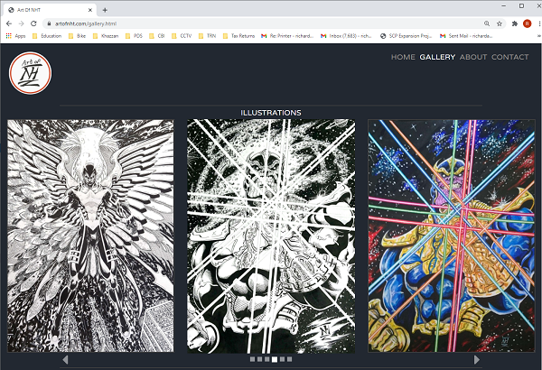
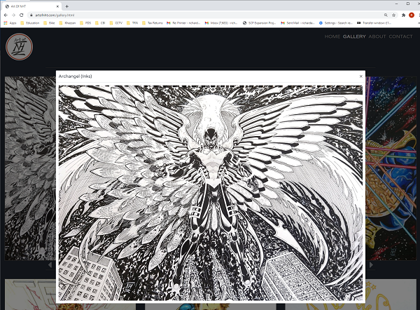

* ***As a user, I am searching for existing comic art to buy.*** The user can browse through the artist's portfolio of work using the [Gallery](gallery.html) page, and is able to contact the artist using the [Contact](contact.html) form. The [Contact](contact.html) form has been manually tested and works succesfully through [Formspree](https://help.formspree.io/hc/en-us).  
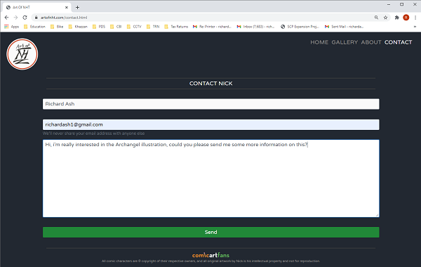

* ***As a user, I am searching for an artist to commission some work.*** The user can browse through the artist's 
portfolio of work using the [Gallery](gallery.html) page, and can view a biography of the artist on the [About](about.html) page.
The user is able to contact the artist using the [Contact](contact.html) form which is linked from the 
[About](about.html) page and the navigation menu. The [Contact](contact.html) form has been manually tested and 
works succesfully through [Formspree](https://help.formspree.io/hc/en-us).  
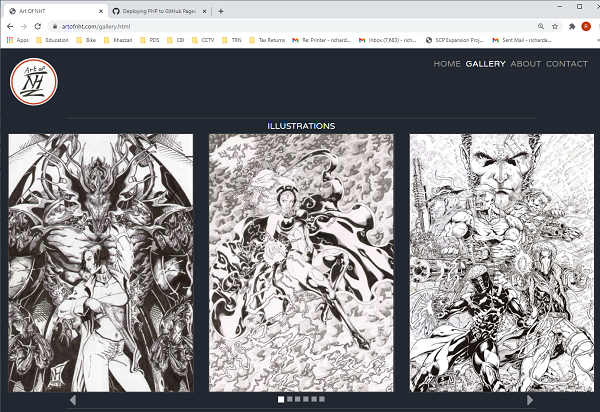
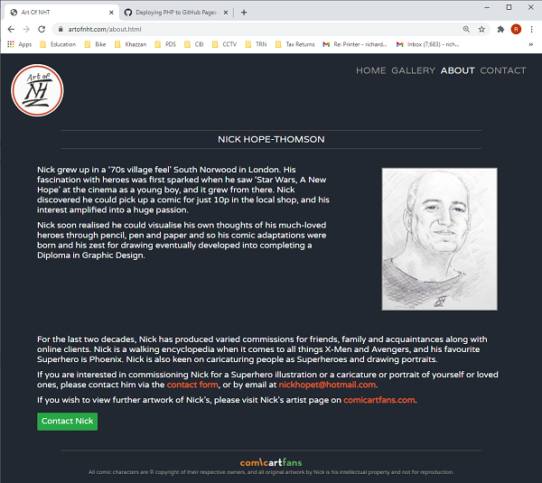

* ***As a user, I want to contact the artist.*** The user is able to contact the artist using the [Contact](contact.html) form. The [Contact](contact.html) form has been manually tested and works succesfully through [Formspree](https://help.formspree.io/hc/en-us).  

* ***As a user, I want to find out more about a specific piece of art.*** When the user clicks on a specific picture in the [Gallery](gallery.html) or on the [Home](index.html) page they are presented with a modal pop up which includes a large version of the picture, the picture name and medium. 
The user is then able to contact the artist using the [Contact](contact.html) form. The [Contact](contact.html) form has been manually tested and works succesfully through [Formspree](https://help.formspree.io/hc/en-us).  
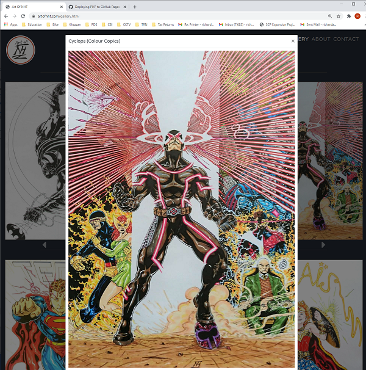
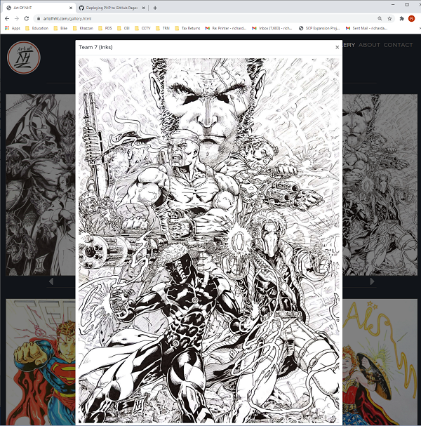

## Additional UX Testing ##
A number of friends and family of the developer and the artist have visited the site and the feedback has been very positive so far. 
Users have said that the site is well designed, looks stylish and is easy to navigate.

## Manual Testing ##
### Navigation Links
Navigation Links and Navigation Links hover styling have been tested on all pages and work correctly.  

 

### Logo Link
Logo link and Logo Link hover styling have been tested on all pages and work correctly (logo links to [Home](index.html) page).  

 

### Footer Link
Footer link and Footer Link hover styling have been tested on all pages and work correctly 
(footer image links to artist's page on [Comic Art Fans](https://www.comicartfans.com/gallerydetail.asp?gcat=682) website).  

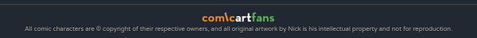

### Home Page Image Modals
[Home](index.html) page pop-up image modals have been tested and work correctly. See [Image Modal Testing](./assets/testing/image-modals) screen prints, also shown below:  

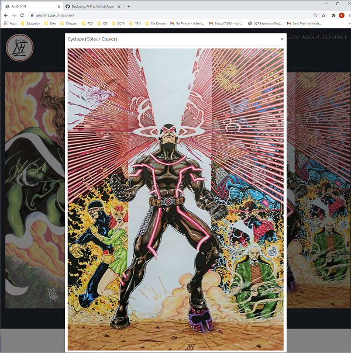

### Gallery Page Image Modals
[Gallery](gallery.html) page pop-up image modals have been tested and work correctly. See [Image Modal Testing](./assets/testing/image-modals) screen prints, a selection of which are shown below:  

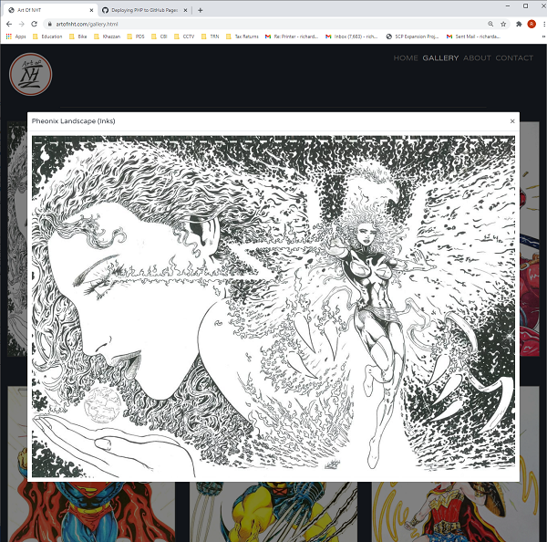
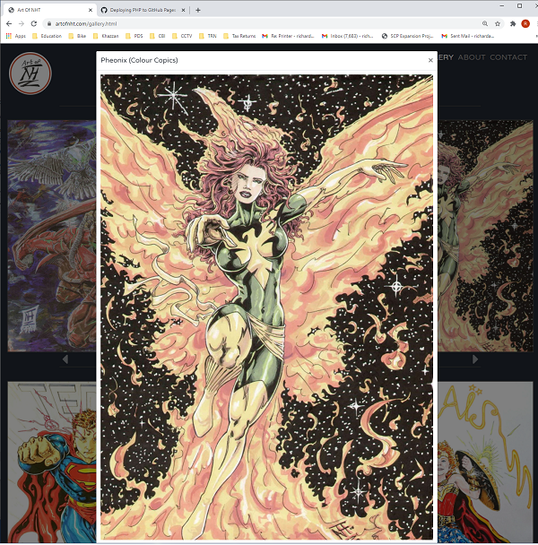
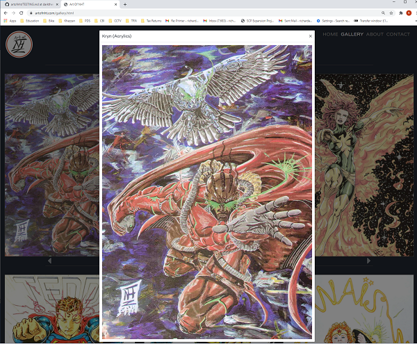

### Gallery Page Carousel Controls
[Gallery](gallery.html) page image carousel controls have been tested for 1 panel, 2 panel and 3 panel carousels and work correctly.  

### Responsive Design ###
* Responsive design has been tested by using the [Chrome DevTools](https://developers.google.com/web/tools/chrome-devtools) to emulate viewing the website on a number of devices with varying screen dimensions, 
including iPhone 5/SE, iPhone 6/7/8, iPhone 6/7/8 plus, iPhone 11, iPad, iPad Pro, Moto G4, Galaxy S5, Surface Duo, Galaxy Fold, Widescreen Laptop and Desktop PC. 
See [Responsive Design Testing](./assets/testing/responsive-design) screen prints, a selection of which are shown below:  

  

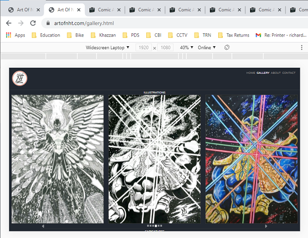

* Responsive design was then further tested using the [Responsive Viewer](https://chrome.google.com/webstore/detail/responsive-viewer/inmopeiepgfljkpkidclfgbgbmfcennb?hl=en)
plug in for chrome. This emulates viewing the website on a large number of devices, including iPhone XR, iPhone XS Max, iPhone XS, iPhone X, Galaxy S9 Plus, Galaxy S8 Plus, Galaxy S9, Note 8, Note S8, Pixel 3, Pixel 3XL,
Medium Desktop PC and Large Desktop PC. See [Responsive Design Testing](./assets/testing/responsive-design) screen prints, also shown below:  

* The [Home](index.html) page images behave as expected - the right hand "cyclops" image is hidden on smaller devices.  
* The [Gallery](gallery.html) carousel behaves as expected, auto-sizing the images fluidly and displaying a 1 panel wide carousel on small screens,
a 2 panel wide carousel on medium screens and a 3 panel wide carousel on large screens.

### About Page Links ###
* The [About](about.html) page profile image links to the [Contact](contact.html) page correctly.
* The [About](about.html) page "contact form" link takes the user to the [Contact](contact.html) page correctly.
* The [About](about.html) page nickhopet@hotmail.com link creates an email to nickhopet@hotmail.com with the user's defualt mail app and works correctly.
* The [About](about.html) page "Contact Nick" button links to the [Contact](contact.html) page correctly.

### Contact Form ###
Each input field of the [Contact](contact.html) form was tested in turn. It was found during testing that the "required" attribute had not been added to the "Name", "Email address" and "Message" form inputs. This has now been added, and the form was re-tested.
* The [Contact](contact.html) form "Name" input was tested by attempting to submit the form with the "Name" input not populated.
Input is required in order to submit the form and the user's name(s) entered previously into the browser are available for selection. The input works as intended.
* The [Contact](contact.html) form "Email address" input was tested by attempting to submit the form with the "Email" input not populated, and then with the "Email" input not populated with a valid email address.
Input is required in order to submit the form, must be in the correct format (requires an @ symbol) and the user's email addresses entered previously into the browser are available for selection. The input works as intended.
* The [Contact](contact.html) form "Message" input was tested by attempting to submit the form with the "Message" input not populated. Input is required in order to submit the form. The input works as intended.
* The [Contact](contact.html) form "Send" buttton was tested by submitting the form. A message is displayed saying that the form was submitted succesfully using [Formspree](https://help.formspree.io/hc/en-us) and an email is sent to nickhopet@hotmail.com. The button works as intended.

See [Contact Form Testing](./assets/testing/contact-form) screen prints, which are also shown below:   

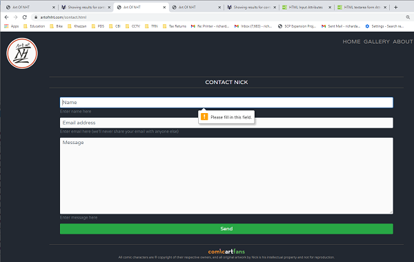
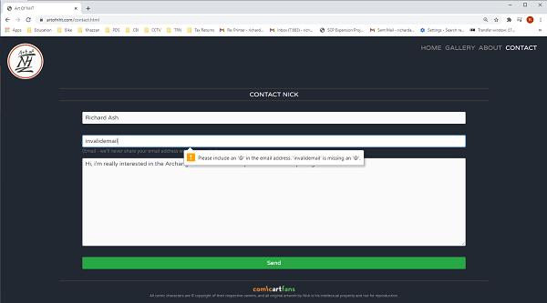
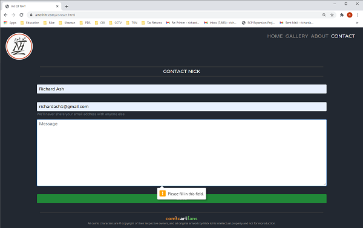
  

### Browser Compatibility Testing ###
The website was tested on the following browsers and operating systems, 
using a combination of manual testing across various devices and the [Browserstack](https://www.browserstack.com/) emulator:
* [Google Chrome](https://www.google.com/intl/en_uk/chrome/) ([Windows 10](https://www.microsoft.com/en-us/windows), [Android 11](https://www.android.com/android-11/) and [Mac OS Big Sur](https://www.apple.com/uk/macos/big-sur/)).
* [Microsoft Edge](https://www.microsoft.com/en-us/edge) ([Windows 10](https://www.microsoft.com/en-us/windows) and [Mac OS Big Sur](https://www.apple.com/uk/macos/big-sur/)).
* [Microsoft Internet Explorer 11](https://support.microsoft.com/en-us/topic/internet-explorer-downloads-d49e1f0d-571c-9a7b-d97e-be248806ca70#ID0EBBD=Windows_10) ([Windows 10](https://www.microsoft.com/en-us/windows)).
* [Safari](https://www.apple.com/uk/safari/) ([Mac OS Big Sur](https://www.apple.com/uk/macos/big-sur/) and [iOS](https://www.apple.com/uk/ios/ios-14/)).
* [Firefox](https://www.mozilla.org/en-GB/firefox/new/) ([Windows 10](https://www.microsoft.com/en-us/windows) and [Mac OS Big Sur](https://www.apple.com/uk/macos/big-sur/)).
* [Yandex](https://browser.yandex.com/) ([Windows 10](https://www.microsoft.com/en-us/windows)).
* [Opera](https://www.opera.com/) ([Windows 10](https://www.microsoft.com/en-us/windows) and [Mac OS Big Sur](https://www.apple.com/uk/macos/big-sur/)).  

The only issue detected was that the fade-ins which are applied to the images on [Home](index.html) and [Gallery](gallery.html) pages
and the titles on the [Contact](contact.html) and [About](about.html) pages don't work in the [Yandex](https://browser.yandex.com/) browser. All images and titles 
still display correctly in the [Yandex](https://browser.yandex.com/) browser without the fade-in animation. The [Yandex](https://browser.yandex.com/) browser accounts for approximately 12% of the browser market share in Russia 
and is not widely used outside of Russia, so this is not seen as a major issue.

## Bugs Fixed During Testing ##
See [Custom CSS Styling](#custom-css-styling) and [HTML](#html) sections for bugs fixed during the automated testing process.  
During the testing process, it was noted that the [Home](index.html) and [Gallery](gallery.html) page images were taking a short while to load in.  
To improve performance, the [Riot](https://riot-optimizer.com/) image optimisation software tool was used to optimise the .jpg images, 
and also to convert the images to progressive .jpg format, which loads in a lower resolution version of the image
while the full resolution image loads in. This has improved the page loading time for the [Home](index.html) and [Gallery](gallery.html) pages.  
Also see [Contact Form](#contact-form) section for further bug fixed during the manual testing process.

## Bugs Remaining ##
There are no known bugs remaining.